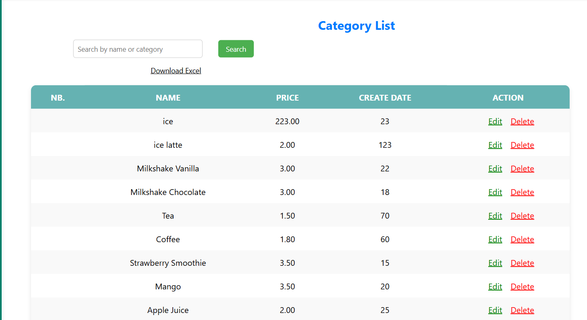

# Process about project #
## folder ##
### Templates ###
- category.html
- index.html
- edit.html
- add. html
- final_receipt.html
- view.html
- process_sale.html
- add.html
- aba.html
### static ###
- images
- style.css

### index.html ###

- product out stock
- category
- admin account
- total sale
- request access
- user account

### category.html ###

- list store the products 
- saler can edit, delete, research, or download.
-
# POS System (Flask + MySQL)

A simple Point Of Sale (POS) web application built with Flask and MySQL. It includes a dashboard, product management, a sale page with product cards, and a receipt generator.

## Tech Stack
- Backend: Flask (Blueprints), flask_mysqldb
- Database: MySQL
- Templating: Jinja2
- Frontend: HTML + CSS (Remix Icon CDN)

## Project Structure
- app.py: Main app factory used in development (static and templates served from frontend/).
- run.py: Alternate app factory using config.Config and default static/ + templates/ paths.
- extensions.py: Initializes MySQL() instance.
- backend/models: Simple data access helpers for products and users.
- backend/routes: Blueprints for auth, product, and receipt features.
- frontend/templates: Jinja templates (dashboard, category/product list, sale, add/edit forms, receipt, login form).
- frontend/static/style.css: Global styles with scoped overrides for specific pages.

## Environment Variables
- MYSQL_HOST: Default 127.0.0.1. On Windows, localhost is normalized to 127.0.0.1.
- MYSQL_PORT: If unset, the app probes 3306 then 3307 and uses the first open port.
- MYSQL_USER: Default root.
- MYSQL_PASSWORD: Default empty.
- MYSQL_DB: Default product.
- SECRET_KEY: Default dev-change-me.

You can set these in your shell before running the app.

## Database Schema (minimum suggested)
Create a database named product (or use MYSQL_DB). Then create tables similar to:

CREATE TABLE products (
  product_id   INT AUTO_INCREMENT PRIMARY KEY,
  product_name VARCHAR(255) NOT NULL,
  price        DECIMAL(10,2) NOT NULL,
  stock        INT NOT NULL DEFAULT 0,
  created_at   TIMESTAMP DEFAULT CURRENT_TIMESTAMP
);

CREATE TABLE users (
  id       INT AUTO_INCREMENT PRIMARY KEY,
  name     VARCHAR(100) NOT NULL,
  email    VARCHAR(255) NOT NULL,
  password VARCHAR(255) NOT NULL
);

Note: The receipt flow currently renders from form data without persisting receipts. A commented receipt_model.py outlines a possible receipt schema.

## How to Run (Development)
1. Install dependencies (example):
   - Python 3.10+
   - pip install flask flask-mysqldb
2. Start MySQL and ensure the database and tables exist.
3. Set environment variables as needed (host, port, user, password, db).
4. Run the app:
   - Using app.py:
          python app.py
     
   - Or using run.py:
          python run.py
     
5. Open http://127.0.0.1:5000/

## Blueprints & Routes
- auth (url_prefix: ``)
  - GET /: Dashboard (renders index.html with totals).
  - POST /register: Create a user (demo).
  - GET /login_form: Login form page.
  - POST /login: Simple login check (demo). 

- product (url_prefix: `/product`)
  - GET /img/<filename>: Serve images from frontend/img/.
  - GET /products: Product list page (search support via ?search=..., and ?download=excel for CSV).
  - GET|POST /add_product: Add product form and handler.
  - GET|POST /edit/<int:product_id>: Edit product.
  - GET /delete/<int:product_id>: Delete product.
  - GET /sale: Sale page with product cards.

- receipt (url_prefix: `/receipt`)
  - GET|POST /products/final: Receipt page. 
    - GET: Show receipt form.
    - POST: Render a receipt card with customer/product/price/stock/date and print button.

## Templates (UI)
- index.html: Dashboard with stats cards and quick links.
- category.html: Product list/table with search and CSV export.
- sale.html: Responsive product card grid with images and order button.
- add.html / edit.html: Product forms.
- receipt.html: Receipt form (no receipt) or rendered receipt card (with print and create-another buttons).
- login_form.html: Styled login form (demo).
## Styling Notes
- Global sidebar layout defined in frontend/static/style.css.
- Page-scoped classes avoid cross-page style conflicts:
  - .category-page for category.html
  - .sale-page (inline styles within sale.html)
  - .receipt-page for receipt.html

## Images
Images are referenced via url_for('product.serve_img', filename=...) from frontend/img/.

## Security & Production Notes
- Passwords are stored in plain text in the demo—do not use in production. Add hashing and proper auth/session management.
- Add CSRF protection, input validation, and error handling for a real deployment.
- Configure a production server (e.g., gunicorn/uwsgi + nginx) and environment variables securely.

## Roadmap Ideas
- Persist receipts with header/items tables; compute totals; receipt history.
- Inventory updates on sale (reduce stock).
- Pagination and richer search/filtering for products.
- User accounts with roles and secure authentication.

## License
MIT or your preferred license.